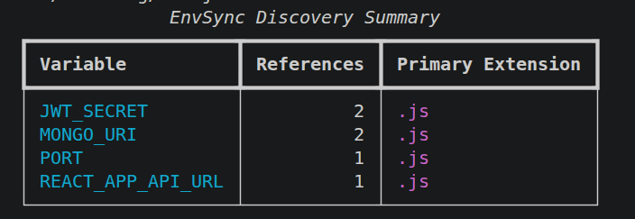
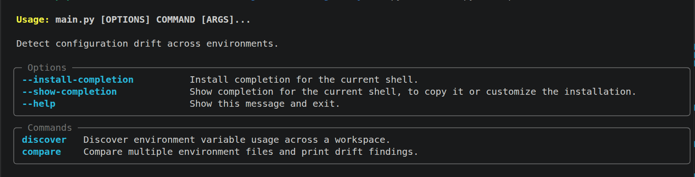
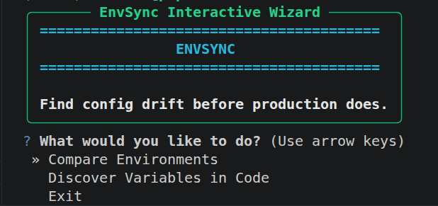

# EnvSync

Detect config drift before it ships to production.

EnvSync is a CLI for teams that are done guessing whether environment config is actually consistent across dev, staging, and prod.

## ⚡ Quick Demo (Under 10 Seconds)

```bash
envsync compare --env examples/dev.env --env examples/staging.env --env examples/prod.env
```

You instantly get:

- Missing keys by environment
- Extra keys by environment
- Different values
- Consistent values

No spreadsheets. No manual spot-checking. No "works on staging" surprises.

## 🚨 Why Teams Use It

EnvSync is built to prevent real incidents, not produce vanity output.

- Missing `DATABASE_URL` in production
- Wrong API endpoint after partial rollout
- Drifted Kubernetes config between clusters
- Secret mismatch discovered too late

If configuration is part of your release risk, this is your safety net.

## 🔐 Security First

Secrets are treated as sensitive by design:

- Secret values are compared via SHA256 digests in memory
- Raw secret values are never printed in terminal reports

You get drift visibility without leaking credentials.

## 📸 Terminal Snapshots







## ✅ Requirements

- Python 3.11+

## 🚀 Setup After Cloning

```bash
git clone https://github.com/MahmoudEzzat8824/EnvSync.git
cd EnvSync
```

Use a virtual environment to avoid system Python restrictions (PEP 668).

### Linux / macOS

```bash
python3 -m venv .venv
source .venv/bin/activate
python -m pip install --upgrade pip
python -m pip install -r requirements.txt
python -m pip install -e .
```

### Windows (PowerShell)

```powershell
py -3 -m venv .venv
.\.venv\Scripts\Activate.ps1
python -m pip install --upgrade pip
python -m pip install -r requirements.txt
python -m pip install -e .
```

### Initial Run Check (Interactive-First)

Linux / macOS:

```bash
python3 main.py
python3 main.py --help
```

Windows (PowerShell):

```powershell
py -3 main.py
py -3 main.py --help
```

## 🧑‍💻 Usage

### Compare Environments

```bash
envsync compare --env examples/dev.env --env examples/staging.env --env examples/prod.env
```

JSON output:

```bash
envsync compare --env examples/dev.env --env examples/staging.env --env examples/prod.env --json
```

Fail CI when drift exists:

```bash
envsync compare --env examples/dev.env --env examples/staging.env --env examples/prod.env --fail-on-drift
```

### Discover Variables in Code

```bash
envsync discover [PATH ...]
```

Generate `.env.template`:

```bash
envsync discover [PATH ...] --generate-template
```

### Interactive CLI

Start wizard:

```bash
envsync
```

Explicit interactive mode:

```bash
envsync interactive
```

Interactive command with direct path(s) (skip menu, scan immediately):

```bash
envsync interactive /absolute/path/to/project
envsync interactive /path/one /path/two --generate-template
```

### Script Mode (Path-First via `main.py`)

```bash
python3 main.py /absolute/path/to/project
python3 main.py /path/one /path/two
```

In script mode, EnvSync performs discovery on provided path(s).

## 🏗️ CI/CD Example (GitHub Actions)

Use EnvSync as a release gate:

```yaml
name: envsync-drift-check
on:
  pull_request:
  push:
    branches: [main]

jobs:
  drift-check:
    runs-on: ubuntu-latest
    steps:
      - uses: actions/checkout@v4

      - uses: actions/setup-python@v5
        with:
          python-version: "3.11"
          cache: "pip"

      - name: Install EnvSync
        run: |
          python -m pip install --upgrade pip
          pip install -r requirements.txt
          pip install -e .

      - name: Verify CLI
        run: envsync --help

      - name: Drift Gate
        run: |
          envsync compare \
            --env examples/dev.env \
            --env examples/staging.env \
            --env examples/prod.env \
            --fail-on-drift
```

Replace example paths with your real environment config files in CI.

## 📦 Input Coverage

EnvSync compares:

- `.env` files as plain key/value pairs
- Kubernetes `.yml` / `.yaml` manifests:
  - `ConfigMap.data`
  - `ConfigMap.binaryData`
  - `Secret.stringData`
  - `Secret.data` (base64 decoded)

Discovery scans source code for environment usage patterns in:

- Python: `os.getenv("VAR")`, `os.environ.get("VAR")`, `os.environ["VAR"]`, `Config("VAR")`
- Node.js / TypeScript: `process.env.VAR`, `process.env["VAR"]`
- Go: `os.Getenv("VAR")`
- PHP: `getenv('VAR')`, `$_ENV['VAR']`

Ignored directories during discovery:

- `node_modules`
- `.git`
- `venv` / `.venv`
- `__pycache__`
- `build`
- `dist`

## ⭐ Support

If EnvSync saves you from one bad deploy, star the repo and share it with your team.